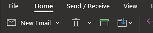
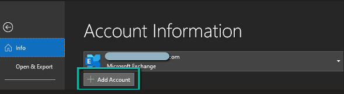
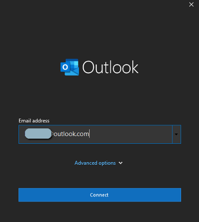

# Add an additional email Accts to Outlook

## Prerequisites/Notes:

	1. You must restart Outlook for changes to take effect after adding additional emails.

## Objective:

	1. Add other email accounts to be accessed in Outlook.

## Steps:

	1. Click "File"

	2. Click "Add Account".

	

	3. Type the email you wish to add and click "Connect".

	

	4. Choose "Microsoft 365" or MS365 emails. It will be different depending on what kind of email provider you are trying to add.

